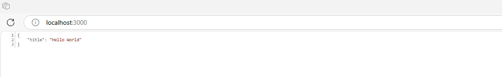
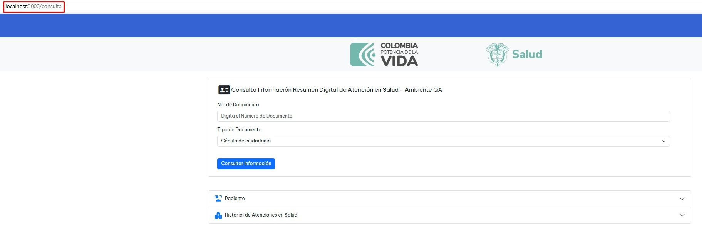
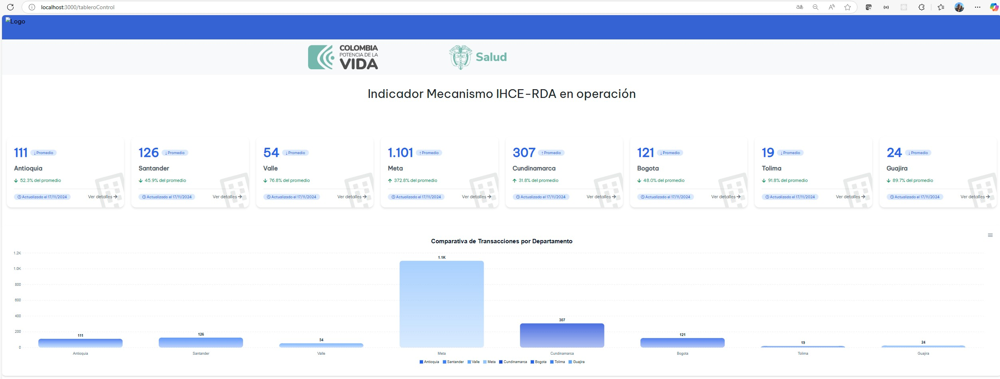

# backend_visor

Repositorio Backend_visorQA

## Descripción

La **Plataforma Web** desarrollada para el Ministerio de Salud y Protección Social está diseñada para facilitar la consulta de la información clínica de los pacientes, en el ejercicio de validación y pruebas de concepto de envío e intercambio de información por los diferentes prestadores de salud haci ael mecanismo de IHCE. Esta herramienta permite acceder a un repositorio unificado de datos, que incluye:

- **Información sobre paciente**
- **Medicamentos**
- **Alergias**
- **Diagnósticos**
- **Atenciones médicas**

## Tecnologías utilizadas

- **Frontend:** HTML, BOOTSTRAP y CSS
- **Backend:** Node.js, Express.js

## Instalación y configuración

### Requisitos previos

- Node.js (versión 14 o superior)
- npm (o yarn)
- Un editor de código (Visual Studio Code, Sublime Text, etc.)

### Clonar el repositorio

```bash
git clone https://github.com/DiegoTorresUSA/backend_visor
cd backend_visor
```

### Instalar Depedencias

```bash
npm install
```

### Configuración de Variables de Entorno

```bash
Para configurar este proyecto, es necesario crear un archivo .env en la raíz del proyecto. Este archivo almacenará las variables de entorno necesarias para que la aplicación funcione correctamente.

- Crear un archivo .env en la raíz del proyecto.

- Añadir las variables proporcionadas en el siguiente ejemplo, reemplazando los valores según necesidades.

# Configuración de APIs externas
URL_BASE = URL_BASE
FHIR_REGION_ID = FHIR_REGION_ID
URL_BASE_REGION = URL_BASE_REGION
URL_BASE_PRESTADOR = URL_BASE_PRESTADOR
API_KEY_DR = API_KEY_DR
API_KEY_PAT = API_KEY_PAT
```

### Iniciar Aplicación

```bash
npm start
```

o 

```bash
npm run dev
```

### Acceder a la aplicación

```bash
http://localhost:3000
```

### Evidencia que el servidor está corriendo

A continuación, se muestra un pantallazo del servidor en funcionamiento:

<p align="center">
  
</p>

### Vista General de la Aplicación de Consulta

A continuación, se muestra un pantallazo de la aplicación en funcionamiento:

<p align="center">
  
</p>

Nota: Tener en cuenta que para ingresar al formulario de consulta es: http://localhost:3000/consulta

### Vista General de la Aplicación del Tablero de Seguimiento

A continuación, se muestra un pantallazo de la aplicación en funcionamiento:

<p align="center">
  
</p>

Nota: Tener en cuenta que para ingresar al fommulario de consulta es: http://localhost:3000/tableroControl

### Estructura del Proyecto

- **app/**: Contiene la lógica de la aplicación.

- **pages/**: html del visor que se renderiza.

- **public/**: Archivos públicos estáticos (CSS, JS, imágenes).

- **routes/**: Definición de rutas de la aplicación y consumo de los servicios.
- **services/**: Lógica de la aplicacion.

- **index.js**: Punto de entrada de la aplicación.

- **.env**: Archivo de configuración de variables de entorno.

- **package.json**: Archivo de dependencias y scripts del proyecto.

- **README.md**: Documentación del proyecto.
